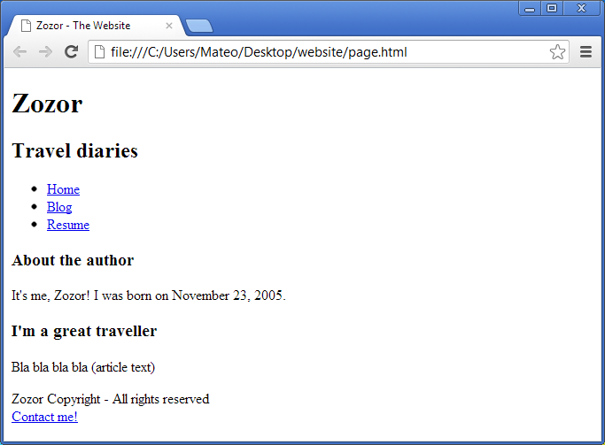

# Teoria Wielkiego Suchara (czyli wszystko od czegoś się zaczyna)

Strony internetowe nie są już statycznymi kawałkami tekstu z odniesieniami do innych takich samych nudnych tekstów. 


_Na pewno było nudno?_

Teraz co raz ciężej odróżnić stronę internetową od aplikacji. Ba, istnieją nawet [gry komputerowe](https://store.steampowered.com/app/597210/Bayou_Island__Point_and_Click_Adventure/) zbudowane dokładnie w tej samej technologii! Powstały nawet specjalne programy do opakowywania stron WWW w taki sposób, żeby instalowały się jak zwykłe oldschoolowe aplikacje z ikonką na pulpicie ([PWA](https://pl.wikipedia.org/wiki/Progressive_web_app), [Electron](https://www.electronjs.org/) — ale to temat na lekcję numer 1458).

Skoro strony WWW nie są już tylko płaskimi plikami HTML to z czego właściwie się składają?

---

## Primo frontend 

Po polsku zwany również _fasadą_…  Zostańmy może jednak przy nazwie frontend :satisfied:

Czymże on jest? Ano wszystkim co widzi nasz użytkownik. W przypadku uniwersum WWW, w który właśnie się zagłębiamy będzie to wszystko co uruchamia się w przeglądarce interentowej. 

A co uruchamia się w przeglądarce? :neutral_face:

### HTML

…to cegły albo kupa wielbłąda (w krajach gdzie buduje się z niej domy). HTML to taki szkielet strony, zawiera strukturę, tekst i obrazki ale nie posiada żadnych danych o tym, w jaki sposób te rzeczy wyświetlić.

* Czy tekst ma być różowy?
* Czy zdjęcie Twojego ulubionego _kota_ ma być duże czy malutkie?
* Czy tekst wyświetlamy za pomocą _Comic Sans_ czy _Times New Roman_?



_Świat czystego HTML'a byłby erm… kijowy_

Na te pytania w czystym HTML'u odpowiedzi nie znajdziesz…

### Arkusze stylów

Tutaj zaczynają się fajerwerki! :sparkler:

Arkusze stylów to nic więcej niż opis wyglądu treści strony. Wraz z rozwojem Internetu otrzymywały one coraz większe możliwości i wpływ na to co wyświetla przeglądarka. Dziś możemy zawrzeć w nich również animacje, prosty tekst oraz obrazki (bez używania dodatkowych zewnętrznych plików [czacha rozjebana :skull:])

__Gdzie możemy upchnąć te tam style?__

Isnieją tak naprawdę trzy miejsca gdzie możemy stylować elementy:

1. W zewnętrznych plikach o rozszerzeniu CSS (to jest eleganckie rozwiązanie)
```html
<link media="all" rel="stylesheet" href="ninja.css" />
```
2. Wewnątrz struktury HTML np. pomiędzy tagami \<head\>\<\head\>.
```html
<style>
body {
    color: Pink;
}
</style>
```
3. Bezpośrednio w tagach HTML
```html
<h1 style="color: Pink">Kucyki Pony 4 Life</h1>
```

Powyższa kolejność nie jest przypadkowa. Otóż możesz nadpisywać wygląd elementów poprzez późniejsze deklaracje. Ostatnia deklaracja no. 3 nadpisze praktycznie wszystko co jest wpisane w plikach CSS oraz w tagach __\<style\>\</style\>__.

Robi się strasznie? Będzie gorzej :ghost: 

Ale to temat na lekcję numer 3.

### JavaScript

O ile gdy powiesz "jestem programistom HTML" możesz naraziś się na uzasadnione ośmieszenie, o tyle w  JS można być programistą… I to całkiem niezłym sk***wielem programistą :rage2:.  

JS jak zapewne wiesz lub nie wiesz, jest najzwyczajniej na świecie językiem programowania. Pojawił się on u zarania dziejów gdzieś w latach 90. Jego początkową rolą było wyświetlanie na stronach spadających śnieżynek (serio). Od tamtej pory sporo się zmieniło. Dziś JS możesz odpalić na serwerze albo napisać w nim całkiem niezła grę. 


_Błagam nie rób śnieżynek na swojej stronie_

Skoro wszystko się nam pokomplikowało to może po krótce: czym kwa jest ten JS dla HTML'a?

Jeżeli:

* HTML to cegły i ściany domu,
* CSS to siding, tynk i różowa farba,
* JS to…

czarodziej, który wywraca to wszystko do góry nogami :alien:

Serio za pomocą JS możesz przemodelować to wszystko co zostało mozolnie zbudowane za pomocą HTML i CSS.

_Chcesz zmienić tekst w nagłówku?_

JEBS! masz nowy tekst w nagłówku.

_Chcesz wstawić 10000 kotów na swoją stronę?_

JEBS! BADUM! 10000 kotów.


_JS jest jak magnes, nikt tak naprawdę nie wie jak to działa_

A tak serio JavaScript pozwala na to żeby to wszystko stało się dynamiczne. Praktycznie jakiekolwiek granice przestają istnieć. Jeżeli dobrze go opanujesz nic nie stoi na przeszkodzie żeby _wyświelić 1000 nowych kotów co sekundę_ fajnie, co?


Kod JS zasadniczo można umieścić wszędzie tam gdzie CSS. 

* W zewnętrznym pliku JS,
* W tagu __<script></script>__,
* W tagu HTML.

---

Więcej i straszinej w lekcji 2! :eyes: